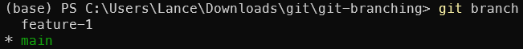
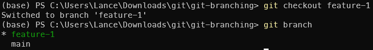
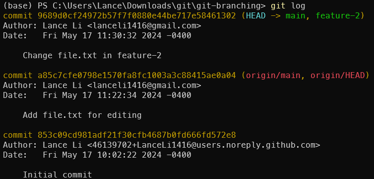
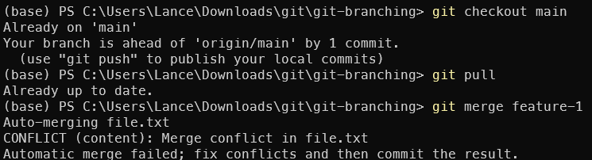
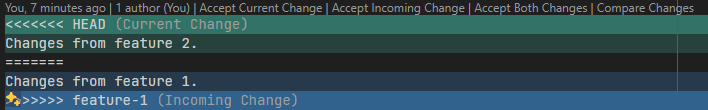
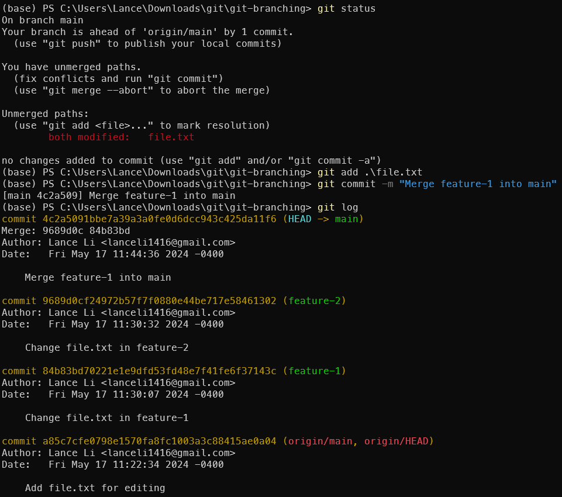

# Branching

Often in times, we want to work on different features of the project. Each of us will work on a `branch` that does not affect the work of others.

> **WARNING:** Branching is hard, and it's really easy to mess up. In that case, do not panic. You can always clone the repo somewhere else and manually copy over the changes.
> 
> If serious merge conflicts / issues happen during development, feel free to ask me or any CS student and we will be happy to help.

In this tutorial, I will guide you through creating branches, and resolving merge conflicts.

## 1. Creating a Branch

> Before creating a new branch, it is recommended that you update the changes from remote first.
> ```sh
> git clone https://github.com/EVOGAMI/git-branching.git && cd git-branching
> git checkout main # just in case
> git fetch origin
> git pull
> ```

> In practice, always created new branches from the `main` branch.

To create a new branch with name `feature-1`, run
```sh
git branch feature-1
```

You can run `git-branch` to show all branches you have.



## 2. Switching to a Branch

After switching to `feature-1`, all the changes and commits we make will stay in that branch. This will avoid conflicting with others as much as possible.

```sh
git checkout feature-1
git branch
```



> *Lance:* You can combine the two commands into one by running `git checkout -b feature-1`.

**Try it Yourself!**

Now, go back to the main branch, and create a new branch called `feature-2`.

See [solutions](#creating-feature-2-branch).

## 3. Merging a Branch

### 3.1 Preparing for Merge

Check out into `feature-1` branch and make some changes.

```sh
git checkout feature-1
# Do this, or edit the file in a text editor
echo "Changes from feature 1." >> file.txt
git add file.txt
git commit -m "Change file.txt in feature-1"
```

Checkout into `feature-2` branch and make some changes.

```sh
git checkout feature-2
# Do this, or edit the file in a text editor
echo "Changes from feature 2." >> file.txt
git add file.txt
git commit -m "Change file.txt in feature-2"
```
### 3.2 Merging `feature-2` into `main`

> **IMPORTANT**: In practice, always merge the `main` branch into your feature branch before merging it back to `main`. This will avoid conflicts and make the merge process easier.

> *Lance:* Always remember to update your branch before merging it back to `main`.

> *Lance:* In practice, we often use a squashed merge to merge a feature branch back to `main`. This will combine all the changes in the feature branch into a single commit in `main`. To do this, use `git merge --squash feature-2` instead of `git merge feature-2`. More on this in [GitHub Operations](https://github.com/EVOGAMI/github-operations).

```sh
git checkout main
git pull # Important!
git merge feature-2
```



## 4. Resolving Merge Conflicts

### 4.1 Merging `feature-1` into `main`

In both feature branches, we have appended some text to `file.txt`. This will cause a merge conflict when merging `feature-1` into `main`.

```sh
git checkout main
git pull
git merge feature-1
```



Oh no!!! Merge conflicts! Well, don't panic. We can resolve this by editing the file manually.

### 4.2-a Resolving Merge Conflicts Manually

Open `file.txt` in a text editor. You will see something like this:

```txt
<<<<<<< HEAD
Changes from feature 2.
=======
Changes from feature 1.
>>>>>>> feature-1
```

* `<<<<<<< HEAD` to `=======` is the changes in the `main` branch, and
* `=======` to `>>>>>>> feature-1` is the changes in the `feature-1` branch.

You can choose to keep one of the changes, combine them, or create a new change altogether. For example:
```txt
Changes from feature 1 and feature 2.
```

> *Lance*: Remember to remove the conflict markers `<<<<<<< HEAD`, `=======`, and `>>>>>>> feature-1`.

### 4.2-b Resolving Merge Conflicts in Code Editor

Modern code editors (like VSCode) have built-in support for resolving merge conflicts. You can use the editor to resolve the conflicts.



### 4.2-c Non-Text Conflicts

If you have conflicts in binary files (like images), you can use a tool like `git mergetool` to resolve the conflicts. However, try to avoid conflicts in binary files as much as possible. If this happens at some point, you can ask me or any CS student for help.

### 4.3 Committing the Resolved Merge

After resolving the conflicts, you need to add the file and commit the changes, just like a normal commit.

```sh
git status
git add file.txt
git commit -m "Merge feature-1 into main"
git log
```



Great! You have successfully resolved the merge conflict.

## 5. Bonus -- Deleting a Branch

After merging a branch, you can delete it to keep the repository clean.

```sh
git branch -d feature-1
git branch -d feature-2
```

## Try it Yourself!

In this repository, there is a file called `conflict.txt` that contains many typos. Your task is to 
1. Fix the typos in the file in a new branch called `fix-typos`. 
2. Merge the branch `lance-fix-typos` into `main`. (I have created this branch for you.)
3. Merge the branch `fix-typos` into `main`, and resolve the merge conflict.

See [solutions](#2-fixing-typos).

***Congratulations! You have successfully mastered branching and merging in Git!***

---

# Solutions

### 1. Creating `feature-2` branch

```sh
git checkout main
git branch feature-2
git checkout feature-2
```
[Go back](#2-switching-to-a-branch)

### 2. Fixing Typos

1. Fix the typos in `conflict.txt` in a new branch called `fix-typos`.
   ```sh
   git checkout -b fix-typos
   # Fix the typos in conflict.txt
   git add conflict.txt
   git commit -m "Fix typos in conflict.txt"
   ```
2. Merge the branch `lance-fix-typos` into `main`.
   ```sh
   git checkout main
   git pull
   git merge lance-fix-typos
   ```
3. Merge the branch `fix-typos` into `main`, and resolve the merge conflict.
   ```sh
   git merge fix-typos
   # Resolve the merge conflict in conflict.txt
   git add conflict.txt
   git commit -m "Merge fix-typos into main"
   ```